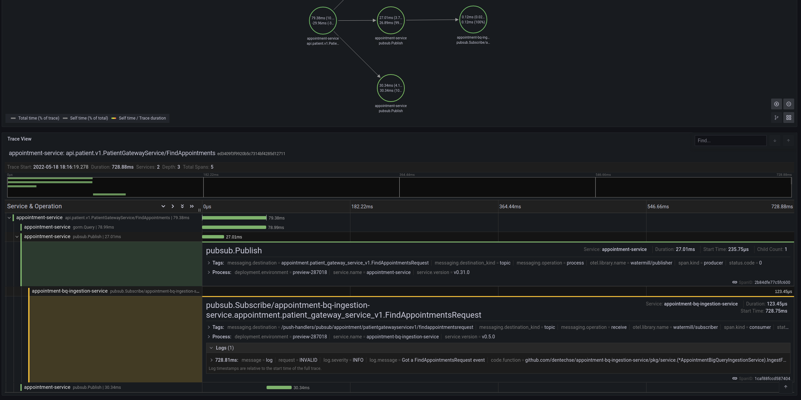

# watermill-opentelemetry-go-extra

This is a complement to the official [watermill-opentelemetry](https://github.com/voi-oss/watermill-opentelemetry) library, where we provide support for propagating trace/span id metadata along with a published message which subscriber(s) then can extract and create child spans from. In other words, it enables us to trace asynchronous messaging flows in the system and thus increase the observability. Here is an example, where a child span was created by another service which is a subscriber of a published message:



## Usage

### For publishers

```go
package example

import (
    "github.com/ThreeDotsLabs/watermill-googlecloud/pkg/googlecloud"
    "github.com/ThreeDotsLabs/watermill/message"
    "github.com/garsue/watermillzap"

    wotelfloss "github.com/dentech-floss/watermill-opentelemetry-go-extra/pkg/opentelemetry"
    wotel "github.com/voi-oss/watermill-opentelemetry/pkg/opentelemetry"

    "go.uber.org/zap"
)

type PublisherConfig struct {
	Name         string
	GCPProjectID string
}

// NewPublisher instantiates a GCP Pub/Sub Publisher with tracing capabilities.
func NewPublisher(logger *zap.Logger, config PublisherConfig) (message.Publisher, error) {

    publisher, err := googlecloud.NewPublisher(
        googlecloud.PublisherConfig{ProjectID: config.GCPProjectID},
        watermillzap.NewLogger(logger),
    )
    if err != nil {
        return nil, err
    }

    // First we let the Watermill/Opentelemetry decorator create a span (the context of the first
    // message will contain this) and then we extract the trace/span id in a second custom 
    // decorator (which this lib provide) that add the trace/span id's as metadata on the message 
    // before delegating to the actual googlecloud publisher.

    tracePropagatingPublisherDecorator := wotelfloss.NewTracePropagatingPublisherDecorator(publisher)
    return wotel.NewNamedPublisherDecorator("pubsub.Publish", tracePropagatingPublisherDecorator)
}
```

### For subscribers

A tracing middleware that extracts the propagated parent trace/span and creates a child span for the message can be defined at the router level, before the Watermill/Opentelemetry middleware:

```go
package example

import (
    "github.com/ThreeDotsLabs/watermill"
    "github.com/ThreeDotsLabs/watermill/message"
    "github.com/garsue/watermillzap"

    wotelfloss "github.com/dentech-floss/watermill-opentelemetry-go-extra/pkg/opentelemetry"
    wotel "github.com/voi-oss/watermill-opentelemetry/pkg/opentelemetry"

    "go.uber.org/zap"
)

func InitTracedRouter(logger *zap.Logger) *message.Router {
    router, err := message.NewRouter(message.RouterConfig{}, watermillzap.NewLogger(logger))
    if err != nil {
        panic(err)
    }

    // First extract the propagated parent trace/span id's from the message metadata 
    // and create a child span for the message, then we start a trace/span.

    router.AddMiddleware(wotelfloss.ExtractRemoteParentSpanContext())
    router.AddMiddleware(wotel.Trace())

    return router
}
```
